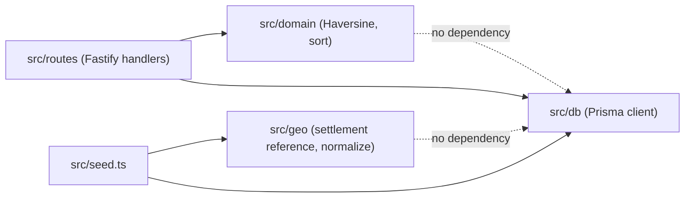

# Architecture Spine — GeoCustomer Backend Service

## Design Paradigm

**Transaction Script** (Fowler). Each of the two HTTP endpoints, and the seed process, is a single top-to-bottom procedure: transport → call one or two plain domain functions → shape the response. No repository, service, or DDD layering — there is exactly one consumer of every piece of logic in this system, and the technical constraints explicitly call for avoiding unnecessary layers. Maps to directories: `src/routes/` (transport), `src/domain/` + `src/geo/` (the scripts' logic, kept pure and framework-free), `src/db/` (the one stateful dependency).

## Invariants & Rules



### AD-1 — Design paradigm: Transaction Script

- **Binds:** CAP-1, CAP-2, CAP-3
- **Prevents:** The two independent harness implementations building incompatible layering (one flat, one repository/service/DDD-layered), making them structurally incomparable and adding ceremony the constraints forbid.
- **Rule:** Each route handler is one top-to-bottom function (transport → domain function(s) → response shape). No repository/service/interface abstraction layers. Domain logic (Haversine, sorting, normalization) is plain exported functions, not classes.

### AD-2 — Nx workspace layout: single project

- **Binds:** all
- **Prevents:** Unnecessary Nx project-boundary ceremony (a lib with exactly one consumer), or abandoning Nx conventions altogether.
- **Rule:** Exactly one Nx project, `apps/api`. Internal folders (`src/routes`, `src/domain`, `src/geo`, `src/db`, `prisma`) provide separation — not a second Nx project or lib.

### AD-3 — Fastify application boundary

- **Binds:** CAP-1, CAP-2
- **Prevents:** Business logic leaking into route registration, or the Fastify instance being built differently for the running server than for tests.
- **Rule:** `src/app.ts` exports `buildApp()` returning a fully-configured Fastify instance with routes registered and no `.listen()` call. `src/server.ts` is the only file that calls `buildApp().listen(...)` and wires process shutdown. Tests import `buildApp()` directly.

### AD-4 — Prisma placement and client lifecycle

- **Binds:** CAP-1, CAP-2, CAP-3
- **Prevents:** Two independently-instantiated Prisma Clients (e.g. one per request, or separate ones in the server and the seed script) causing connection-pool exhaustion or schema drift.
- **Rule:** One schema at `apps/api/prisma/schema.prisma`; migrations in `apps/api/prisma/migrations/` (Prisma default). One generated client. One shared `src/db/client.ts` exporting a single lazily-created `PrismaClient` singleton, imported by both `server.ts` and `seed.ts`. Nothing else instantiates `PrismaClient` directly.

### AD-5 — Seed separation and idempotency mechanism

- **Binds:** CAP-3
- **Prevents:** Seed logic reachable over HTTP, the server auto-seeding on boot, or two independently-built idempotency strategies (wipe-and-reinsert vs. upsert) behaving differently across re-runs.
- **Rule:** Seed logic lives only in `src/seed.ts`, run via its own command (`nx run api:seed`), never imported by `app.ts`/`server.ts`. Idempotency is enforced via a Prisma `@@unique([name, telepules, countryCode])` constraint on `Customer` — the closest available natural key, per the approved `countryCode` decision — and the seed uses **upsert** keyed on that triple, not truncate-and-reinsert. The process disconnects Prisma and exits after running.

### AD-6 — Offline settlement reference placement and normalization

- **Binds:** CAP-3
- **Prevents:** Two independently-built normalization functions disagreeing on case/accent/whitespace handling, producing different geocoding outcomes for the same input.
- **Rule:** Reference data lives in one file, `src/geo/settlement-coordinates.ts` (plain exported map, not a DB table). One exported `normalizeSettlementName()` (Unicode NFD-normalize + strip diacritics + lowercase + trim) is the only place normalization happens. Budapest district/`kerület` aliases live beside the reference and resolve through the same function to the capital's coordinates.

### AD-7 — Haversine and sorting boundary

- **Binds:** CAP-2
- **Prevents:** Distance/sorting logic duplicated or reimplemented differently between the route handler and its tests, or coupled to Fastify/Prisma types so it can't be unit tested without a database.
- **Rule:** `src/domain/distance.ts` exports pure `haversineKm(a, b)`. `src/domain/sort.ts` exports pure `sortByDistance(customers)` implementing null-last-with-name-tiebreak. Neither module imports Fastify or Prisma types. The route handler is the only caller wiring them to real data.

### AD-8 — Vitest placement and categories

- **Binds:** CAP-1, CAP-2, CAP-3 (testing)
- **Prevents:** The mandatory Haversine unit tests accidentally requiring a live Postgres to run, making CI slow or flaky.
- **Rule:** Unit tests are co-located `*.spec.ts` next to the pure modules they test (`src/domain/distance.spec.ts`, `src/domain/sort.spec.ts`, `src/geo/normalize.spec.ts`) and must not import Prisma or start Fastify. Any endpoint-level test touching a live DB is a separate, explicitly optional integration test — not part of the default required test target.

### AD-9 — Docker Compose PostgreSQL setup

- **Binds:** CAP-3, dev workflow
- **Prevents:** Divergent ad-hoc local Postgres setups (native installs, mismatched ports) that make fresh-clone reproducibility unreliable.
- **Rule:** One `docker-compose.yml` at repo root with one `postgres` service pinned to `postgres:16-alpine` (PostgreSQL 16 — a frozen requirement, not a latest-stable pick), a named volume for persistence, and credentials/db-name/port sourced from `.env` (placeholder-only values in the committed `.env.example`). `DATABASE_URL` for Prisma is assembled from those same env vars.

### AD-10 — Project-scoped PostgreSQL MCP configuration

- **Binds:** dev workflow, SPEC MCP requirements
- **Prevents:** MCP setup requiring machine-specific manual steps that break on a fresh clone, or secrets being committed.
- **Rule:** MCP server is `postgres-mcp` (crystaldba, PyPI — the actively maintained replacement for Anthropic's archived, vulnerable `@modelcontextprotocol/server-postgres`), launched via `uvx postgres-mcp --access-mode=restricted`. Its configuration (a repo-committed `.mcp.json`) references `DATABASE_URL` from the environment and never inlines a connection string. Works after `docker compose up` plus copying `.env.example` to `.env` on a fresh clone. Restricted/read-only access mode matches the SPEC's inspect-only MCP usage.

### AD-11 — Clean shutdown and error-handling boundaries

- **Binds:** CAP-1, CAP-2, server lifecycle
- **Prevents:** The process hanging on `SIGTERM` (leaked DB connections), or an unhandled route error crashing the process or leaking a stack trace to the client.
- **Rule:** `server.ts` registers `SIGINT`/`SIGTERM` handlers that call `app.close()`, which (via Fastify's `onClose` hook) disconnects the shared Prisma client before the process exits. Fastify's global error handler catches thrown errors, logs them via Fastify's built-in logger, and returns a generic error JSON body — no unhandled rejection may crash the process silently.

## Consistency Conventions

| Concern | Convention |
| --- | --- |
| Naming | camelCase for TS identifiers; Prisma model `Customer` (PascalCase) `@@map`-ed to table `customers`; field names (`telepules`, `lat`, `lon`, `countryCode`) match SPEC.md verbatim — not translated or renamed. |
| Data & formats | `distanceKm` is a JS `number`, rounded via `Math.round(x * 10) / 10`, `null` when unresolved (never the string `"null"`). `Customer.id`: `Int @default(autoincrement())` — never exposed as a stable external identifier, so its format carries no cross-unit risk. Error shape: Fastify's default error envelope; no custom problem-details layer. |
| State & cross-cutting | Configuration via environment variables only (no config files/CLI flags). Logging via Fastify's built-in `pino` logger — no separate logging library. No auth middleware exists at all, not even a stub, per Non-goals. |

## Stack

Three distinct kinds of claim live here — kept separate so a "current latest" research note is never mistaken for a frozen requirement.

### Frozen by the authoritative specification (technology choice; most versions are NOT pinned)

| Name | Requirement |
| --- | --- |
| Node.js | LTS release (technical-constraints.md; exact version selected at implementation time) |
| TypeScript | strict mode enabled (technical-constraints.md; exact version selected at implementation time) |
| pnpm | required package manager (technical-constraints.md; exact version selected at implementation time) |
| Nx | required monorepo tool (technical-constraints.md; exact version selected at implementation time) |
| Fastify | required HTTP framework (technical-constraints.md; exact version selected at implementation time) |
| Prisma | required for schema/migrations/seed/typed access (technical-constraints.md; exact version selected at implementation time) |
| Vitest | required test framework (technical-constraints.md; exact version selected at implementation time) |
| PostgreSQL | **16 exactly**, Docker image `postgres:16-alpine` — a frozen requirement, corrected from an earlier draft that mis-picked 18 from "latest stable" |

### Architecture-level compatibility requirements (this spine's own call — not spec text)

- The Node.js LTS release selected at implementation time must support the chosen Prisma major version's engine requirements.
- The chosen Prisma major version must support PostgreSQL 16 as a target database.
- The chosen Fastify major version must support the selected Node.js LTS release.
- `postgres-mcp` (the dev-only MCP tool, AD-10) must support connecting to PostgreSQL 16.
- Verify each of the above against current docs when the workspace is scaffolded — this spine fixes the compatibility *requirement*, not the specific versions that satisfy it.

### Implementation-time package versions (selected during implementation, recorded via the lockfile — not fixed by this spine)

Exact minor/patch versions of TypeScript, pnpm, Nx, Fastify, Prisma, and Vitest are chosen when the workspace is scaffolded and recorded in `pnpm-lock.yaml`. Reference only, not binding — current stable lines as of 2026-07-13 web verification, for context: Node 24.x (Active LTS), Fastify 5.x, Prisma 7.x, Vitest 4.x (not the 5.0 beta), Nx 22.x, pnpm 11.x. None of these specific numbers are required by `docs/assignment.md` or `docs/technical-constraints.md`; do not treat them as frozen.

`postgres-mcp` (crystaldba) itself: latest via `uvx` — a dev-only tool, not a runtime dependency of the shipped service; pin later only if reproducibility becomes a concern.

## Structural Seed

```text
{repo-root}/
  apps/
    api/
      src/
        app.ts                        # buildApp(): Fastify instance + routes, no .listen()
        server.ts                     # entrypoint: buildApp().listen() + shutdown wiring
        seed.ts                       # dedicated seed entrypoint, never imported by app.ts
        routes/
          customers.ts                # GET /customers/count, GET /customers/by-distance
        domain/
          distance.ts                 # haversineKm() -- pure
          distance.spec.ts
          sort.ts                     # sortByDistance() -- pure
          sort.spec.ts
        geo/
          settlement-coordinates.ts   # bundled telepules -> lat/lon reference + Budapest district aliases
          normalize.ts                # normalizeSettlementName() -- pure
          normalize.spec.ts
        db/
          client.ts                   # single PrismaClient singleton, used by app.ts and seed.ts
      prisma/
        schema.prisma
        migrations/
      project.json                    # Nx targets: serve, seed, build, test
  docker-compose.yml                  # single postgres:16-alpine service
  .env.example                       # placeholder DATABASE_URL and PG* vars
  .mcp.json                          # project-scoped MCP config, reads DATABASE_URL from env
  README.md
```

## Capability → Architecture Map

| Capability | Lives in | Governed by |
| --- | --- | --- |
| CAP-1 (`GET /customers/count`) | `src/routes/customers.ts` + `src/db/client.ts` | AD-3, AD-4 |
| CAP-2 (`GET /customers/by-distance`) | `src/routes/customers.ts` + `src/domain/distance.ts` + `src/domain/sort.ts` | AD-3, AD-7 |
| CAP-3 (idempotent offline seed) | `src/seed.ts` + `src/geo/*` + `src/db/client.ts` | AD-4, AD-5, AD-6 |

## Deferred

- **Rejected overengineering** (recorded for traceability, not adopted): repository/service/DDD layering; a separate Nx lib for domain logic; a message-queue/event-driven seed pipeline; PostGIS or DB-side geospatial distance functions; an external geocoding API or coordinate cache; a custom API error-envelope/problem-details layer; a cache (Redis or in-memory) in front of `by-distance`; a mandatory e2e/integration test project against a live Postgres; containerizing the Fastify API itself in Docker Compose. Each is excluded by an existing SPEC constraint, non-goal, or the project's small scale — see the memlog for the one-line reason against each.
- **`Customer.id` generation strategy** (`autoincrement` vs. a UUID/cuid) — not elevated to an `AD`: the id is never exposed externally and nothing in this single-service system depends on its format, so two independently-built pieces could not actually diverge incompatibly over it.
- **Exact TypeScript minor version** — left to implementation time rather than pinned here, consistent with the SPEC's own "Node.js LTS" assumption.
- **Exact settlement-coordinate dataset contents** (which cities, which coordinate source) — a content-authoring task for the epics/stories phase, not a structural decision.
- **`postgres-mcp` version pin** — currently unpinned (latest via `uvx`); revisit only if reproducibility issues surface, since it is a dev-time tool, not a shipped dependency.
